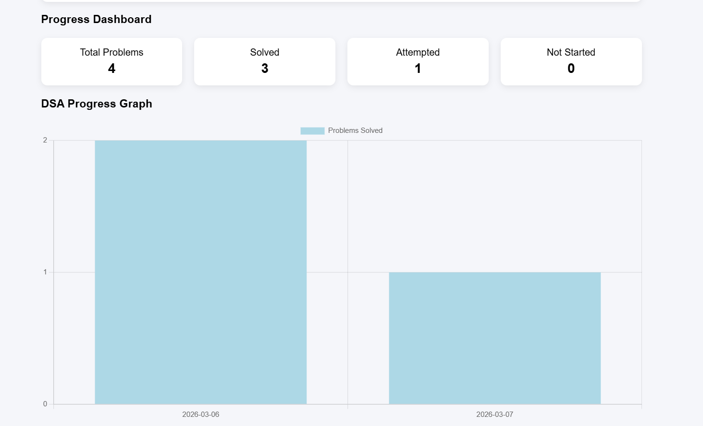
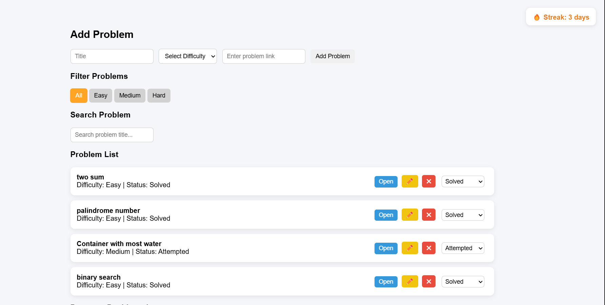

# DSA JourneyMate

DSA JourneyMate is a full-stack problem tracking dashboard built for practicing data structures and algorithms with with analytics dashboard, revision reminders, and streak tracking.

## Live Demo
https://dsa-journey-mate-zgoo.vercel.app/

## Features

• Add DSA problems with difficulty & links
• Track status (Not Started / Attempted / Solved)  
• Filter problems by difficulty 
• Search problems
• Progress dashboard with statistics  
• DSA progress graph
• Revision reminder system
• Daily streak tracking 

## Tech Stack

Frontend:
HTML, 
CSS, 
JavaScript

Backend:
Node.js, 
Express.js

Database:
MongoDB Atlas

Charts:
Chart.js

## Deployment
Frontend:
Vercel

Backend:
Render

## ScreenShots

### Dashboard

### Add Problem

### Revision System
